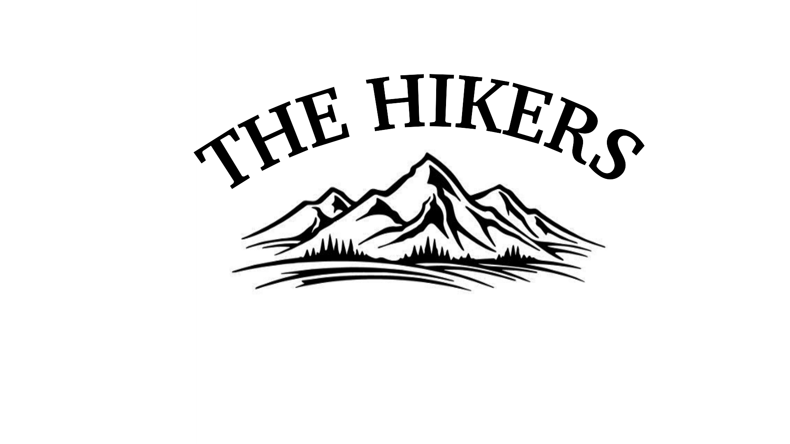

# The Hikers

The aim of this project was to create a website for the THE HICKERS group and help it to promote it on the market 

## Table of contents

- [Overview](#overview)
- [User stories](#user-stories)
- [UX](#ux)
- [Features](#features)
- [Technologies used](#technologies-used)
- [Resourses](#resourses)
- [References for learning](#references-for-learning)
- [Testing](#testing)
- [Project barriers and the solutions](#project-barriers-and-the-solutions)
- [Code validity](#code-validity)
- [Version Control](#version-control)
- [Deployment](#deployment)
- [Credits](#credits)
- [Acknowledgments](#acknowledgments)
- [Support](#support)

## Demo
---
A live demo can be found [here](#)

## Overview
---

 - This is my first Milestone 1 project which is part of the Code Institute’s FullStack Software Development Diploma Course. This project demonstrates the skills and knowledge of the HTML, CSS, Bootstrap 7 and User Centric Frontend Development modules which I have learned recently on the course. 
 - The aim of this fictional website is to promote The Hikers group on the market, make the group recognizable and to present their offer of organized trips in the Irish mountains for people looking for adventure, unforgettable experiences, interested in discovering Irish mountain trails, spending time actively.
---

## User stories
1.  As a new visitor I want to easily navigate the site, so I can find what I need efficiently
2. As a new visitor I want view this group tours videos and read about their offer so I can decide if I am interested in buying a tour with them
3. As a potential client I want to know what thought of past clients who participated in the tours
4. As a potential client I want  to view their offer and expected prices for each trip so I can deside which tour I would like to take
5. As a interested client I want to understand the booking process of the tour
6. As a viinterested observer and potential client I want to follow the group on social media and keep up with their upcoming tours.

----
## UX

This website design will target people of different age groups and families from the country as well as visitors to ireland hence its purpose is an overall simple but effective eye catching website. The priority is direct contact and links to social media.

---

1. Strategy

My goal in this project is to promote the group on the market and increase interest in the tours they offer and grow their bussiness by providing the UX simple, clean and user-friendly. 

### Bussiness goals:
- Promote the new group on the market
- Demonstrate examples of tours to show customers what they can expect
- Increase the number of followers on social media
- Encouraging to spend time actively and discover beautiful Ireland

### Customer Goals:
- Easy to read information About Us, long enough to understand the content but not to overwhelm.
- Easy to find contact details to ask questions or book a trip
- Easy to find the address and location of the group
- Easy to find links to social media accounts to follow as well as see what new the group is organizing
- Easy to find video of existing trips which the group offer
- Design with mobile devices in mind as this is probably the most common way to find information
- Fixed navigation bar providing user easy navigation reference.
- Fixed footer providing quick reference to Social Media links.

2. Scope

I chose the MVP (Minimal Viable Product) approach which:
- It provides users with pure UX
- It includes mobile-first website that is responsive on all devices.
- It fits with my current skills.
- It defines content quickly and focuses on contacting via email or social media. 

3. Structure

The main purpose of the structure is to enable users to quickly navigate through the website, easily assimilate information and have overview through images and videos from the trips to show what can be expected by buyers on the offered trips. A selection of high-quality images that gives special accent for the website. Contact details are provided via the e-mail contact form  and links to social media in the footer. 

4. Skeleton

## Wireframe mockups:
- [Home](wireframes/home-page-wireframe)
- [About](wireframes/about-page-wireframe)
- [Tours](wireframes/tours-page-wireframe)
- [Gallery](wireframes/gallery-page-wireframe)
- [Contact](wireframes/contact-page-wireframe)

- Pages/Section: Home, About Us, Tours, Gallery, Contact
- Fixed navigation bar - Menu headings and pointing to each of the 5 Pages
- Fixed footer with Contact email-link and phone number, Copyright info and Social Madia icons

---
5. Surface

 **Colors**

 **Typography**
- "Yusei Magic" font (with fall-back font of) for main headings. This font was specifically chosen for its rounded edges, which relate to natural curves in nature.
- "Montserrat" font (with fall-back font of Sans-Serif) for body content.

 **Images**

---
## Features

In this section, you should go over the different parts of your project, and describe each in a sentence or so.

**Existing Features**
-
-
-

**Features Left to Implement when skills develop**

Another feature idea
-
-
---

## Technologies Used

In this section, you should mention all of the languages, frameworks, libraries, and any other tools that you have used to construct this project. For each, provide its name, a link to its official site and a short sentence of why it was used.

1. Languages

2. Integrations

3. Workspace, version control and Repository storage

4. Other

5. IDE Extensions used in GitPod

---
## Resources
-
-
-
-

----

## References for learning

---
## Testing

-
-
-

---

## Project barriers and the solutions
-
-
-

---

## Code validity

---

## Version Control

-
-
-

---

## Deployment

This project has been deployed on GitHub Pages with the following process:
-
-
-

---

## Credits

**Media**

The text, images, links and other data in the database was sourced from various local websites including but not limited to
-
-

**Content**
The text for section Y was copied from the Wikipedia article Z

**Code Snippets**
-
-
-

---
## Acknowledgments

I would like to thank:

I received inspiration for this project from:

---
## Support

For any issue resolution or assistance, please email Ewa Kukla kuklaewa@gmail.com
